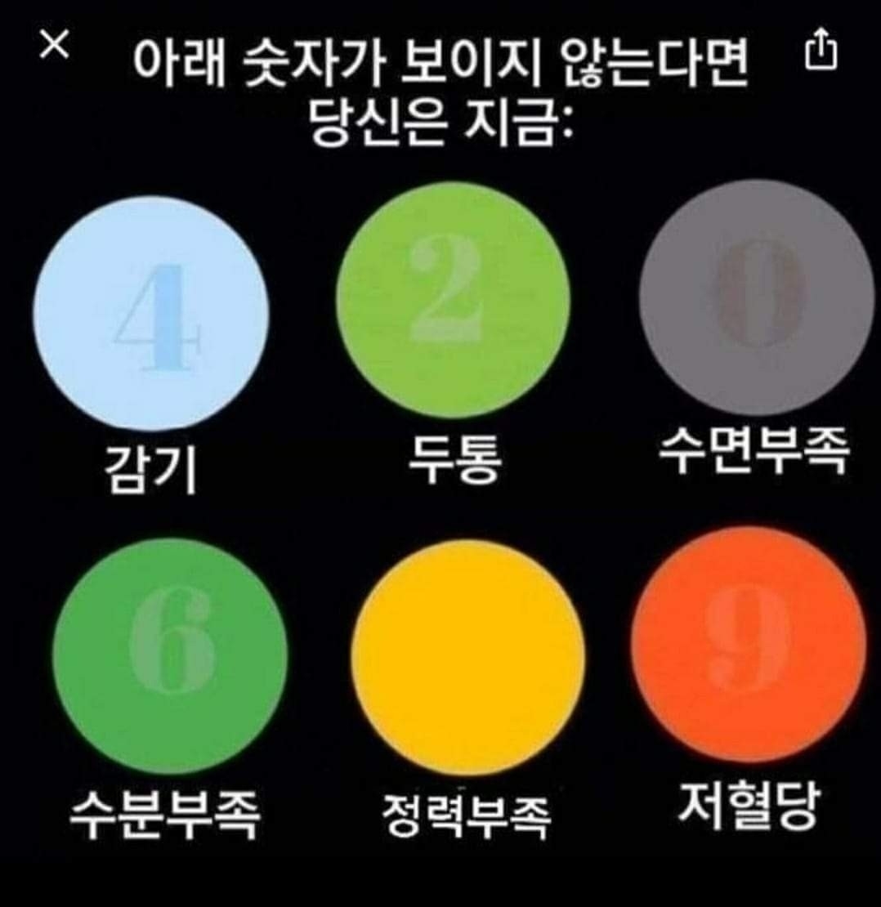

```{r setup, include=FALSE}
knitr::opts_chunk$set(echo = TRUE, message=FALSE, warning=FALSE,
                      comment="", digits = 3, tidy = FALSE, prompt = FALSE, fig.align = 'center')

```

{width="289"}

# 원문 테스트 이미지 {#basic-image-test}


```{r get-image}

library(tidyverse)
library(magick)

test_img <- image_read("fig/color-health-test.jpg") %>% 
  image_resize("30%")

top_img <- test_img %>% 
  image_crop(geometry = "320x95+10+60")

bottom_img <- test_img %>% 
  image_crop(geometry = "320x95+10+190")

first_img <- top_img %>% 
  image_crop(geometry = "110x95")
second_img <- top_img %>% 
  image_crop(geometry = "110x95+100")
third_img <- top_img %>% 
  image_crop(geometry = "110x95+200")

forth_img <- bottom_img %>% 
  image_crop(geometry = "110x95")
fifth_img <- bottom_img %>% 
  image_crop(geometry = "110x95+100")
sixth_img <- bottom_img %>% 
  image_crop(geometry = "110x95+210")

img_list <- list(first_img, second_img, third_img, forth_img, fifth_img, 
       sixth_img)

img_bg_list <- map(img_list, image_fill, color = "white", refcolor = "#0E0E0E", 
                  fuzz = 10)
```


# 이미지 분석 {#basic-image-test-analysis}

- [Jeroen Ooms (2018/10/16), "Working with Images in R", Institute for Geoinformatics, WWU Münster](https://jeroen.github.io/munster2018/)

## 하나 이미지 {#basic-image-test-analysis-one}

```{r get-image-analysis}

count_colors <- function(image){
  data <- image_data(image) %>%
    apply(2:3, paste, collapse= "") %>% 
    as.vector %>% table() %>%  as.data.frame() %>% 
    setNames(c("col", "freq"))
  data$col <- paste("#",data$col, sep="")
  return(data)
}

plot_hist <- function(data){
  img <- image_graph(500, 500)
  plot <- ggplot2::ggplot(data) + 
    geom_bar(aes(col, freq, fill = I(col)), stat = 'identity') +
    theme(axis.title = element_blank(), axis.text.y = element_blank(),
          axis.ticks.y = element_blank())
  print(plot)
  dev.off()
  img
}

hist_img <- first_img %>% 
  image_quantize(6, colorspace = 'YCbCr') %>% 
  count_colors() %>% 
  plot_hist() %>% 
  image_resize("300x150")

image_append(c(first_img %>% image_resize("300x150"), hist_img))
```

## 전체 이미지 {#basic-image-test-analysis-all}

```{r get-image-analysis-all}

analyze_image <- function(input_image) {
  
  hist_img <- input_image %>% 
    image_quantize(6, colorspace = 'YCbCr') %>% 
    count_colors() %>% 
    plot_hist() %>% 
    image_resize("300x150")

  image_append(c(input_image %>% image_resize("300x150"), hist_img))

}

hist_img_list <-  map(img_bg_list, analyze_image)


hist_img_list %>% 
  image_join() %>% 
  image_animate(fps = 0.5)
```


## 5 번 이미지 {#basic-image-test-analysis-five}

```{r five-image}

fifth_img <- bottom_img %>% 
  image_crop(geometry = "110x95+100")

fifth_bg_img <- fifth_img %>% 
  image_fill(color = "white", refcolor = "#0E0E0E", 
                  fuzz = 30) %>% 
  image_transparent(color = "white")

fifth_bg_img %>% 
  image_quantize(6, colorspace = 'YCbCr') %>% 
  count_colors() %>% 
  plot_hist()

bottom_img %>% 
  image_crop(geometry = "110x95+100") %>% 
  image_fill(color = "black", refcolor = "#00870000", 
                  fuzz = 10)

color_freq <- bottom_img %>% 
  image_crop(geometry = "95x95+115+5") %>% 
  image_quantize(10) %>% 
  count_colors()

color_freq

bottom_img %>% 
  image_crop(geometry = "95x95+115+5") %>% 
  image_quantize(10) %>% 
  image_fill(color = "blue", refcolor = "#977b3e", fuzz = 35) %>%
  image_fill(color = "blue", refcolor = "#977b3e", fuzz = 35) %>% 
  image_fill(color = "blue", refcolor = "#cfae5a", fuzz = 35) %>%  
  image_fill(color = "blue", refcolor = "#debf59", fuzz = 35) %>% 
  image_fill(color = "blue", refcolor = "#eeb933", fuzz = 35)
```

