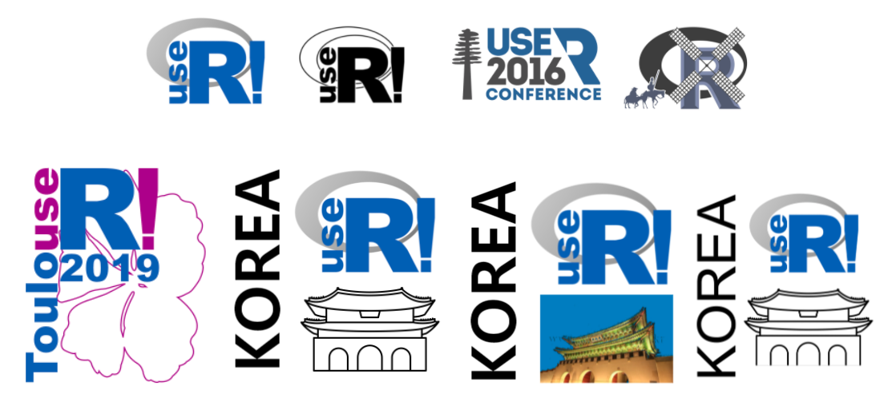

```{r setup, include=FALSE}
knitr::opts_chunk$set(echo = TRUE, message=FALSE, warning=FALSE,
                      comment="", digits = 3, tidy = FALSE, prompt = FALSE, fig.align = 'center')

```





# 로고제작 기본 이미지 {#basic-image}

구글 이미지 검색을 통해 [`useR! 2021 Korea`](https://use-r.kr/) 컨퍼런스 제작에 필요한 로고를 제작한다.

## 광화문 {#광화문}

[Noun Project](https://thenounproject.com/) 웹사이트에서 광화문(Gwanghwamun Gate) 이미지를 다운로드 받아 R에서 불러온다.

```{r basic-image}
library(tidyverse)
library(magick)

gwanghwamun_raw <- image_read("fig/noun_Gwanghwamun Gate_260270.png")

gwanghwamun <- gwanghwamun_raw %>% 
  image_crop(geometry = "700x500")

gwanghwamun
```


## useR! 로고 {#useR-logo}

마찬가지 방식으로 구글 이미지 검색을 통해 useR! 로고를 다운로드 받는다. 먼저 검정색 로고를 다운로드 받는다.

```{r useR-logo-black}

useR_black_raw <- image_read("fig/user-logo-positive.png")

useR_black <- useR_black_raw %>% 
  image_resize("30%")

useR_black
```

색상이 들어간 useR! 로고를 다운로드 받는다.

```{r useR-logo-color}
useR_color_raw <- image_read("fig/user-logo-color.png")

useR_color <- useR_color_raw %>% 
  image_resize("20%")

useR_color
```


## 로고 제작 {#make-rlogo}

앞서 다운로드 받은 이미지를 로고 캔바스에 올려 크기를 조정하여 최종 로고를 제작한다.

```{r make-logo}
## 로고 캔바스 -------------------------
logo_blank <- image_blank(width = 477, height= 500, color = "white", pseudo_image = "", defines = NULL)

## useR 로고 크기조정 -------------------------
useR_color_resized <- useR_color %>% 
  image_crop(geometry = "300x270+00+30")

## 광화문 로고 크기조정 -------------------------
gwanghwamun_resized <- image_crop(gwanghwamun, geometry = "530x350+95+100") %>% 
  image_scale("330")

## useR! Korea logo -------------------------
useR_korea <- logo_blank %>% 
  # image_annotate("KOREA", size = 130, degrees = 90, location = "+110+10") %>% 
  image_annotate("KOREA", size = 130, degrees = -90, location = "+20+470") %>% 
  image_composite(useR_color_resized,  offset = "+130+10") %>% 
  image_composite(gwanghwamun_resized,  offset = "+130+215")

useR_korea <- image_transparent(useR_korea, 'white')

useR_korea 
```

## 로고 저장 {#save-logo}

마지막으로 제작한 `useR! 2021 Korea` 로고를 `.png`, `.svg` 파일로 저장시킨다.

```{r save-logo}
image_write(useR_korea, path ="fig/useR_Korea.png", format = "png")
image_write(useR_korea, path ="fig/useR_Korea.svg", format = "svg")
```

- `useR! 2021 Korea` 다운로드
    - [PNG](fig/useR_Korea.png)
    - [SVG](fig/useR_Korea.svg)

# koRea 로고 제작 {#koRea-logo}

`useR!` 브랜드와 충돌이 있어 새로운 한국 R 컨퍼런스 로고를 제작한다. [R 로고](https://www.r-project.org/logo/) 웹사이트에서 로고를 받아 기본 이미지로 사용한다.

```{r useR-logo}
library(tidyverse)
library(magick)

R_logo <- image_read("fig/Rlogo.png")

R_logo
```


## koRea 컨퍼런스 로고 {#koRea-logo}

```{r koRea-make-logo}
logo_blank <- image_blank(width = 270, height= 60, color = "white", pseudo_image = "", defines = NULL)

## R 로고 크기조정 -------------------------
R_logo_resized <- R_logo %>% 
  image_scale("45") %>% 
  image_transparent(color = "white")

## useR! Korea logo -------------------------
koRea_logo <- logo_blank %>% 
  image_annotate("KO              EA", size = 20, location = "+5+25", font = "NanumBarunGothic YetHangul")  %>% 
  image_annotate("컨퍼런스", size = 37, location = "+120+10", font = "NanumBarunGothic YetHangul")  %>% 
  image_composite(R_logo_resized %>% image_rotate(degrees = -15), offset = "+32+00")

koRea_logo <- image_transparent(koRea_logo, 'white')

koRea_logo %>% 
  image_resize("200%")
```

## 내보내기 {#export-logo-koRea}

```{r export-logo-koRea}
image_write(koRea_logo, path ="fig/koRea_logo.png", format = "png")
image_write(koRea_logo, path ="fig/koRea_logo.svg", format = "svg")
```

- 로고 다운로드
    - [koRea 컨퍼런스 PNG](fig/koRea_logo.png)
    - [koRea 컨퍼런스 SVG](fig/koRea_logo.png.svg)


# 영문 koRea 로고 제작 {#koRea-logo-english}

## koRea Conference 로고 {#koRea-logo-english}

```{r koRea-make-logo-english}
logo_blank <- image_blank(width = 270, height= 60, color = "white", pseudo_image = "", defines = NULL)

## R 로고 크기조정 -------------------------
R_logo_resized <- R_logo %>% 
  image_scale("45") %>% 
  image_transparent(color = "white")

## useR! Korea logo -------------------------
koRea_english_logo <- logo_blank %>% 
  image_annotate("KO              EA", size = 20, location = "+5+25", font = "NanumBarunGothic YetHangul")  %>% 
  image_annotate("Conference", size = 27, location = "+120+10", font = "NanumBarunGothic YetHangul")  %>% 
  image_composite(R_logo_resized %>% image_rotate(degrees = -15), offset = "+32+00")

koRea_english_logo <- image_transparent(koRea_english_logo, 'white')

koRea_english_logo %>% 
  image_resize("200%")
```

## 내보내기 {#export-logo-koRea-english}

```{r export-logo-koRea-english}
image_write(koRea_english_logo, path ="fig/koRea_english_logo.png", format = "png")
image_write(koRea_english_logo, path ="fig/koRea_english_logo.svg", format = "svg")
```


