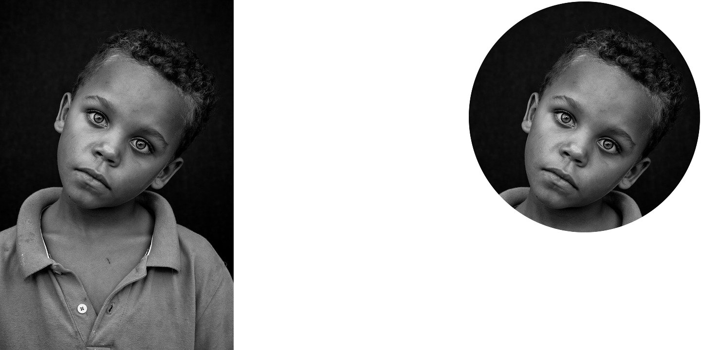

```{r setup, include=FALSE}
knitr::opts_chunk$set(echo = TRUE, message=FALSE, warning=FALSE,
                      comment="", digits = 3, tidy = FALSE, prompt = FALSE, fig.align = 'center')

```


# 졸업 앨범 사진 [^stackoverflow-graduation] {#stackoverflow}

[^stackoverflow-graduation]: [stackoverflow, "R magick: Square crop and circular mask"](https://stackoverflow.com/questions/64597525/r-magick-square-crop-and-circular-mask)

[stackoverflow, "R magick: Square crop and circular mask"](https://stackoverflow.com/questions/64597525/r-magick-square-crop-and-circular-mask)을 참조하여 일반 사진을 어떻게 졸업앨범 느낌이 나는 사진으로 변환하는지 살펴보자.



```{r tidyverse-magick}
library(tidyverse)
library(magick)

im <- magick::image_read("https://cdn.pixabay.com/photo/2016/08/17/21/12/people-1601516_960_720.jpg")

# get height, width and crop longer side to match shorter side
ii <- magick::image_info(im)
ii_min <- min(ii$width, ii$height)
im1 <- magick::image_crop(im, geometry=paste0(ii_min, "x", ii_min, "+0+0"), repage=TRUE)

# create a new image with white background and black circle
fig <- magick::image_draw(image_blank(ii_min, ii_min))
symbols(ii_min/2, ii_min/2, circles=(ii_min/2)-3, bg='black', inches=FALSE, add=TRUE)
dev.off()

# create an image composite using both images
im2 <- magick::image_composite(im1, fig, operator='copyopacity')

# set background as white
graduate_im <- magick::image_background(im2, 'white')

# 내보내기 --------------
# image_append(c(im, image_blank(ii_min, ii_min, color = "white"), graduate_im)) %>%
#   image_write(path = "fig/graduation.png")
```


# 사진 제작 함수 {#stackoverflow-function}

## 스크립트 &rarr; 함수 {#script2function}

먼저 스크립트를 함수로 변환시키는 코드를 작성하고 테스트를 한다.

```{r make-figure-function}

create_figure <- function() {
  
  img <- magick::image_read("https://cdn.pixabay.com/photo/2016/08/17/21/12/people-1601516_960_720.jpg")
  
  ii <- magick::image_info(img)
  ii_min <- min(ii$width, ii$height)
  cropped_img <- magick::image_crop(img, geometry=paste0(ii_min, "x", ii_min, "+0+0"), repage=TRUE)
  
  fig <- magick::image_draw(image_blank(ii_min, ii_min))
  symbols(ii_min/2, ii_min/2, circles=(ii_min/2)-3, bg='black', inches=FALSE, add=TRUE)
  dev.off()
  
  im2 <- magick::image_composite(cropped_img, fig, operator='copyopacity')
  
  created_img <- magick::image_background(im2, 'white')
  
  return(created_img)
}

create_figure()
```

## 사진 인자 반영 {#script2function-argument}

고정된 사진이 아니라 인자를 달리하여 입력되는 사진을 졸얼앨범 사진으로 제작하도록 로직을 변경한다.

```{r make-figure-function-argument}

create_figure <- function(figure) {
  
  img <- magick::image_read(figure) %>% 
    image_resize(300)
  
  ii <- magick::image_info(img)
  ii_min <- min(ii$width, ii$height)
  cropped_img <- magick::image_crop(img, geometry=paste0(ii_min, "x", ii_min, "+0+0"), repage=TRUE)
  
  fig <- magick::image_draw(image_blank(ii_min, ii_min))
  symbols(ii_min/2, ii_min/2, circles=(ii_min/2)-3, bg='black', inches=FALSE, add=TRUE)
  dev.off()
  
  im2 <- magick::image_composite(cropped_img, fig, operator='copyopacity')
  
  created_img <- magick::image_background(im2, 'white')
  
  return(created_img)
}

create_figure("fig/rconf/julia_silge.jpg")
```

## 자동화 {#script2function-argument-automation}

`create_figure()` 함수를 사용해서 특정 디렉토리에 포함된 모든 사진을 자동변환시켜보자.

```{r make-figure-function-argument-automation}

fig_list <- fs::dir_ls("fig/rconf")

fig_processed_list <- map(fig_list, create_figure)

## list --> image 객체
fig_join_img <- image_join(fig_processed_list)

image_append(fig_join_img, stack = FALSE)
```


## 내보내기 {#script2function-argument-automation-write}

`create_figure()` 함수 조정해서 처리된 결과를 메모리상 `magick` 객체로 두는 것이 아니라 로컬 컴퓨터에 저장시켜보자.
`fs::path_ext_remove()` 함수를 사용해서 파일 확장자를 제거하고 `_processed.png` 파일을 저장시킨다.

```{r make-figure-function-argument-automation2}
create_figure <- function(figure) {
  
  img <- magick::image_read(figure) %>% 
    image_resize(300)
  
  ii <- magick::image_info(img)
  ii_min <- min(ii$width, ii$height)
  cropped_img <- magick::image_crop(img, geometry=paste0(ii_min, "x", ii_min, "+0+0"), repage=TRUE)
  
  fig <- magick::image_draw(image_blank(ii_min, ii_min))
  symbols(ii_min/2, ii_min/2, circles=(ii_min/2)-3, bg='black', inches=FALSE, add=TRUE)
  dev.off()
  
  im2 <- magick::image_composite(cropped_img, fig, operator='copyopacity')
  
  created_img <- magick::image_background(im2, 'white')
  
  created_img %>% 
    image_write(path = glue::glue("{fs::path_ext_remove(figure)}_processed.png"))
  
  return(created_img)
}

create_figure("fig/rconf/julia_silge.jpg")
```

앞서 작업한 결과를 확인해보자.

```{r check-result2}
image_read("fig/rconf/julia_silge_processed.png")
```

## 내보내기 자동화 {#script2function-argument-automation-write-auto}

특정 디렉토리에 있는 모든 파일을 처리해서 자동화시키자.

```{r make-figure-function-argument-automation-all}
fig_list <- fs::dir_ls("fig/rconf")
walk(fig_list, create_figure)
```

`fs` 팩키지 `dir_ls()` 함수 `glob` 기능을 이용하여 작업 내용을 확인해보자.

```{r check-result}
fs::dir_ls("fig/rconf", glob = "*processed.png")
```

