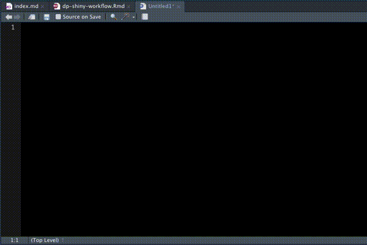
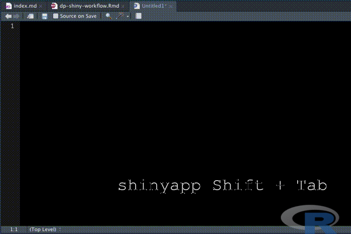

```{r setup, include=FALSE}
knitr::opts_chunk$set(echo = TRUE, message=FALSE, warning=FALSE,
                      comment="", digits = 3, tidy = FALSE, prompt = FALSE, fig.align = 'center')

```


# 맥 동영상 &rarr; GIF {#gif-file}

[`gifr`](https://github.com/LucyMcGowan/gifr) 팩키지를 활용하여 `.mov` 확장자를 갖는 동영상을 `.gif` 파일로 변환시킬 수 있다. `gifr` 팩키지 설치할 때 다음 옵션을 추가하면 쉽게 설치할 수 있으며 `ffmpeg`, `gifsicle`을 미리 설치해야 의존성 문제를 피할 수 있다.

`devtools::install_github("LucyMcGowan/gifr", INSTALL_opts="--no-staged-install")`

```{r mac-gif-file}
library(tidyverse)
library(gifr)

make_gif(input = "fig/shinyapp_workflow.mov", output = "fig/shinyapp_workflow.gif")

```




[`gifr`](https://github.com/LucyMcGowan/gifr) 팩키지를 활용하여 `.mov` 확장자를 갖는 동영상을 `.gif` 파일로 변환시킬 수 있다.


# GIF 텍스트와 이미지 추가 {#gif-file-annotation}

GIF 파일에 로고와 같은 이미지를 부탁하고 텍스트를 추가시킬 수 있다.

```{r make-gif-file}
library(magick)

# 공백 이미지
blank_img <- image_blank(width = 600, height = 400, color = "none")

# R 로고 추가
logo <- image_read("https://jeroen.github.io/images/Rlogo.png") %>%
  image_resize("100x50!")

# 텍스트와 로고 추가
blank_logo_img <- blank_img %>% 
  image_composite(logo, 
                  operator = "blend", compose_args="50",
                  offset   = "+480+350") %>% 
  image_annotate(text = "shinyapp Shift + Tab", 
                 font = "mono",
                 location = "+200+300", 
                 size = 30, 
                 color = "white") %>% 
  image_transparent(color = "white")

# GIF 파일 가져오기
shiny_gif <- magick::image_read("fig/shinyapp_workflow.gif")

shiny_text_gif <- image_composite(shiny_gif, blank_logo_img)

shiny_text_gif %>% 
  image_write(path = "fig/shiny_text_gif.gif")

```


