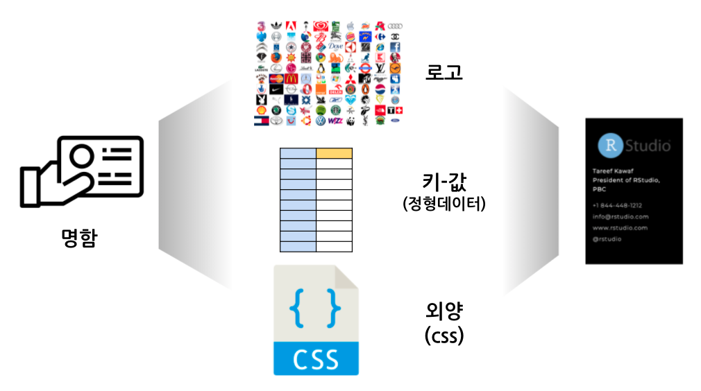

```{r setup, include=FALSE}
knitr::opts_chunk$set(echo = TRUE, message=FALSE, warning=FALSE,
                      comment="", digits = 3, tidy = FALSE, prompt = FALSE, fig.align = 'center')

```



# 명함 [^business-card] {#business-cards}

[^business-card]: [Yihui Xie and Romain Lesur (2021-06-23), "`pagedown`: Create Paged HTML Documents for Printing from R Markdown - A Less Traveled Road to PDF and Printing](https://rstudio.github.io/pagedown/#business-card)

명함은 `pagedown` 기능을 이용하여 구현할 수 있다. 크게 3가지 기능이 명함제작에 필요한데 로고, 키-값으로 구성된 명함 정보, 그리고 명함 외양(css)으로 나눌 수 있다.

이를 위해 먼저 로고를 제작해보자.


# R 사용자회 로고 {#user-logo}

[useR! 2021 Korea 로고 제작](https://statkclee.github.io/art/art-logo.html) 참고하여 로고를 60x250 크기로 제작한다.

```{r make-user-logo}
library(tidyverse)
library(magick)

gwanghwamun_raw <- image_read("fig/noun_Gwanghwamun Gate_260270.png")

gwanghwamun <- gwanghwamun_raw %>% 
  image_crop(geometry = "700x500")


## 로고 캔바스 -------------------------
logo_blank <- image_blank(width = 250, height= 60, color = "white", pseudo_image = "", defines = NULL)

## 광화문 로고 크기조정 -------------------------
gwanghwamun_resized <- image_crop(gwanghwamun, geometry = "530x350+95+105") %>% 
  image_scale("60")

## useR! Korea logo -------------------------
R_user_group <- logo_blank %>% 
  image_annotate("R 사용자회", size = 37, location = "+75+10", font = "NanumBarunGothic YetHangul")  %>% 
  image_composite(gwanghwamun_resized,  offset = "+10+5")

R_user_group <- image_transparent(R_user_group, 'white')

R_user_group
```

# 내보내기 {#export-logo}

```{r export-logo}
image_write(R_user_group, path ="fig/R_user_group.png", format = "png")
image_write(R_user_group, path ="fig/R_user_group.svg", format = "svg")
```

- 로고 다운로드
    - [PNG](fig/R_user_group.png)
    - [SVG](fig/R_user_group.svg)

