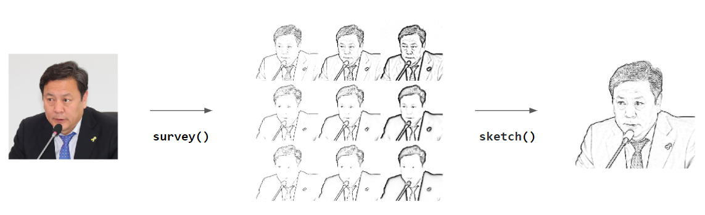
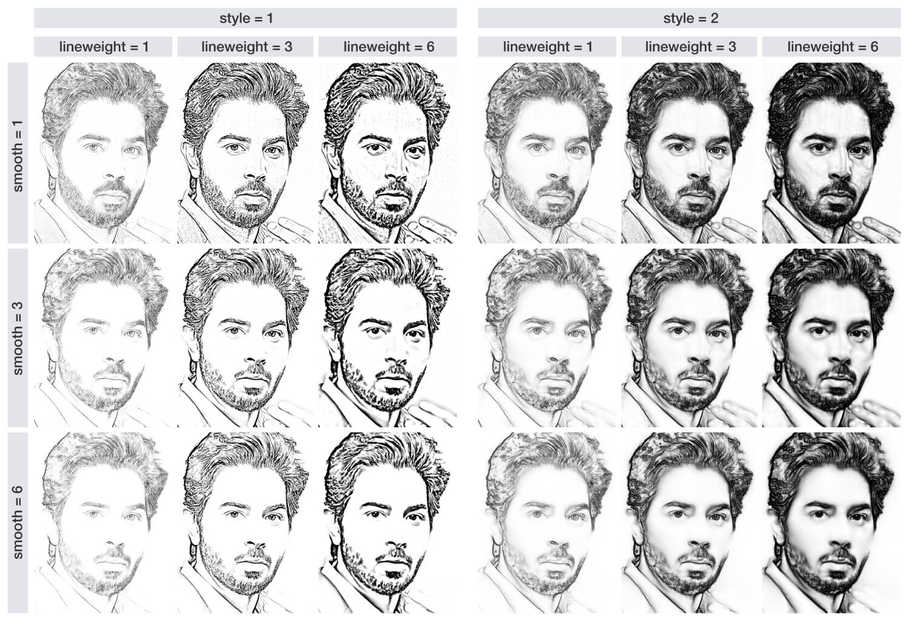

```{r setup, include=FALSE}
knitr::opts_chunk$set(echo = TRUE, message=FALSE, warning=FALSE,
                      comment="", digits = 3, tidy = FALSE, prompt = FALSE, fig.align = 'center')

```

<center>

</center>

# 원본 이미지 {#image-get}

[sketcher: An R package for photo to sketch effects](https://htsuda.net/sketcher) 팩키지를 사용하여 사진으로 찍은 이미지를 스케치 이미지로 바꾼다.

먼저 `imager` 팩키지 기반 이미지 작업을 해야 되기 때문에 [sketcher: An R package for photo to sketch effects](https://htsuda.net/sketcher) 팩키지를 설치하고 `imager` 팩키지도 설치되지 않는 경우 설치하여 환경 준비를 마치고 해당 사진도 준비한다.


```{r sketcher-pkg}
library(tidyverse)
library(magick)
library(imager)
library(sketcher)

# cho_magick <- image_read("fig/jscho.png")
# Magick --> Image 객체 변환 -----
# cho_image <- magick2cimg(cho_magick, alpha ="rm")

cho_image <- im_load("fig/jscho.png")

plot(cho_image)
```

# 탐색 {#image-survey}

`survey()` 함수가 제공되어 `sketch()`에 사용될 적절한 매개변수를 선정하는 작업을 수행한다.

```{r sketch-survey}
cho_survey_image <- survey(cho_image,
                           style         = 1,
                           weight_levels = c(1,2,4), 
                           smooth_levels = c(1,3,5),
                           gain          = 0.3,
                           shadow        = 0.1,
                           contrast      = 20,
                           # contrast = 1,
                           verbose       = TRUE
)

plot(cho_survey_image)
```

혹은, [tsuda16k/sketcher](https://github.com/tsuda16k/sketcher) 사례를 참조하여 적절한 매개변수를 선정하여 스케치 작업 결과를 얻는다.



# 스케치 작업 확정 {#image-survey-sketch}

앞선 탐색과정에서 선정한 매개변수를 `sketch()` 함수에 넣어 스케치 작업을 확정한다.

```{r sketch-select-sketch}
cho_sketch_image <- sketch(cho_image,
                           style         = 1,
                           lineweight    = 1, 
                           smooth        = 1,
                           gain          = 0.1,
                           shadow        = 0.1,
                           # contrast = 1
)

plot(cho_sketch_image)
```

# 스케치 파일 저장 {#image-survey-sketch-save}

`fig/cho_sketch.png` 파일명으로 저장한다.

```{r sketch-save-image}
im_save(cho_sketch_image, name = "cho_sketch.png", path = "fig", format = "png")
```

# 동영상 {#sketch-animation}

`save_sketch()` 함수를 제작하여 각 단계별로 스케치한 결과물을 이미지로 저장한다.

```{r sketch-animation}
cho_image <- im_load("fig/jscho.png")

fs::dir_create("fig/sketch")

cho_tbl <- expand_grid(line_weights  = c(1,3,5),
                       smooth_levels = c(1,3,5))

save_sketch <- function(line_weight, smooth_level) {
  sketch_image <- sketch(cho_image,
                         style         = 1,
                         lineweight    = line_weight, 
                         smooth        = smooth_level,
  )
  
  im_save(sketch_image, name = glue::glue("sketch_{line_weight}{smooth_level}.png"), 
          path = "fig/sketch", format = "png")
}

map2(cho_tbl$line_weights, cho_tbl$smooth_levels, save_sketch)
```

다시 이미지를 불러와서 애니메이션을 제작한다.

```{r sketch-animation-gif-preview}
library(magick)

# 스케치 이미지 
sketch_files <- fs::dir_ls("fig/sketch")

sketch_img <- map(sketch_files, image_read)

# 리스트를 tibble 객체로 변환
raw_img <- image_join(sketch_img)

# 전체 스케치 살펴보기
raw_img %>% 
  image_scale("150") %>% 
  image_append(stack = FALSE)
```

중간에 `JS Cho` 이니셜을 넣어 준다.

```{r sketch-gif-copyright}
raw_reorder_img <- c(raw_img[3], raw_img[2], raw_img[1],
                     raw_img[6], raw_img[5], raw_img[4],
                     raw_img[9], raw_img[8], raw_img[7])

copyright_img <- raw_reorder_img %>% 
  image_scale("250") %>% 
  image_annotate(text     = "JS Cho", 
                 location = "+205+220", 
                 color    = "midnightblue")

# copyright_img
js_animation <- image_animate(copyright_img, fps = 1/2)
js_animation
```

중간에 `JS Cho` 이니셜을 넣어 준다.

```{r sketch-gif-copyright-save}
image_write(js_animation, path = "fig/js_cho.gif")
```
