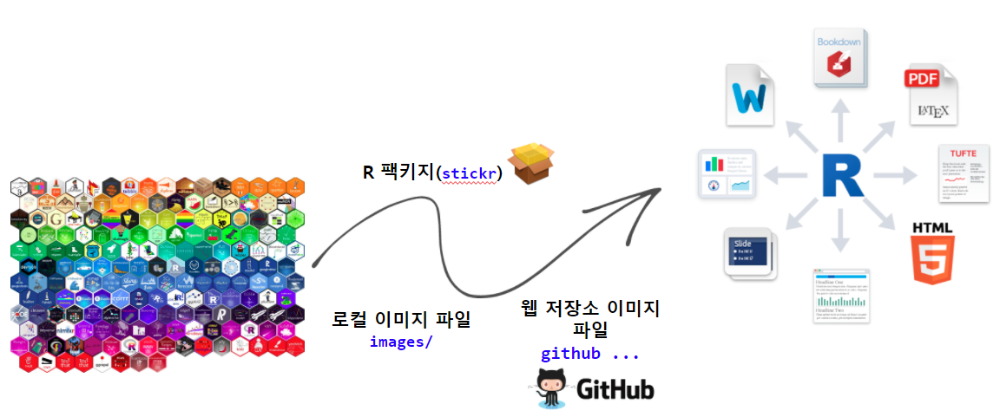

```{r setup, include=FALSE}
knitr::opts_chunk$set(echo = TRUE, message=FALSE, warning=FALSE,
                      comment="", digits = 3, tidy = FALSE, prompt = FALSE, fig.align = 'center')

```

<center>

</center>

# 팩키지와 스티커 [^packages-revolutions] {#sticker-embedding}

[^packages-revolutions]: [David Smith (January 27, 2017), "CRAN now has 10,000 R packages. Here's how to find the ones you need.", Revolutions](https://blog.revolutionanalytics.com/2017/01/cran-10000.html)

R 팩키지는 GitHub에 공개된 것을 포함할 경우 공식적으로 수만개에 이르는 것으로 추산된다.
현재, R/Tidyverse 기반 데이터 과학 서비스와 제품은 대부분 수많은 팩키지를 조합하여 개발되고 있다.
미래의 나도 재현가능하도록 작성된 R 코드와 마크다운 문서를 볼 때 스티커를 조합시켜 시각화하는 것도 단순히 `library()` 혹은 `require()` 함수를 호출하는 것보다 큰 의미가 있을 듯 싶다. 


# `stickr` 팩키지 {#stickr}

가장 먼저 스티커 팩키지가 개발되어 있어 [`stickr`](https://cran.rstudio.com/web/packages/stickr/index.html) 를 활용하는 방식을 먼저 살펴보자.
`stickr` 팩키지는 <https://github.com/rstudio/hex-stickers> 뿐만 아니라 `GitHub` 저장소의 R 육각형 스티커를 이용할 수 있는 장점이 있다.

## 다운로드 방식 {#download-stickers}

가장 먼저 `stickr` 팩키지를 사용해서 `tidyverse` 로고를 로컬 컴퓨터에 저장하고 나서 이를 `magick` 팩키지를 사용해서 시각화하는 방식을 살펴보자.

```{r install-stickr}
# install.packages("stickr")
library(stickr)
library(tidyverse)

stickr_get("tidyverse", view = FALSE, destfile = "fig/tidyverse.png")

magick::image_read("fig/tidyverse.png") %>% 
  magick::image_resize("150x150")

```

## R마크다운 문서 직삽입 {#download-stickers}

R마크다운 문서에 직삽입하는 방법으로 `stickr_insert` 함수를 제공한다.
`stickr_insert` 함수는 `knitr` 팩키지 `include_graphics` 함수를 사용하기 때문에 `include_graphics` 함수의 특성을 그대로 반영할 수 있다.
R 코드 덩어리의 `out.width = "20%"`와 같은 인자값을 조정하여 크기를 조정한다.

```{r install-stickr-on-the-fly, out.width = "20%"}
stickr_insert("tidyverse", dpi = 300)
```


# 다수 스티커 {#many-stickr}

스티커가 하나가 아니고 다수인 경우 `purrr` 팩키지 내장된 함수를 사용한다.

```{r many-stickers}
pkgs <- c("tidytuesdayR", "tidyverse", "dplyr", "ggplot2", "usethis")
destfile <- glue::glue("{here::here()}/fig/{pkgs}.png")

# destfile <- glue::glue("{here::here()}/fig/{pkgs}.png")
# pkgs_filename <- glue::glue("{pkgs}.png")
# pmap_list <- list(name = pkgs, destfile = destfile, filename = pkgs_filename)
# pmap(pmap_list, stickr_get, view = FALSE)

map2(pkgs, destfile, stickr_get, view = FALSE)
```

R 스티커 이미지가 `.png` 파일로 다운로드 되었기 때문에 이를 조합하여 크기를 통일시키고 일렬로 쭉 배열시킨다.

```{r many-stickers-combine}
library(magick)

pkgs_img <- map(destfile, image_read) %>% 
  image_join(.)

pkgs_img %>% 
  image_resize(geometry = "150x150") %>% 
  image_append(stack = FALSE)
```


# 팩키지 &rarr; 그림 한장 {#many-stickr-viz}

팩키지 목록을 쭉 넣게 되면 한장의 그림으로 시각화하는 함수를 제작해 보자.

```{r many-stickers-combine-one-fig}
downloaded_pkg <- map(pkgs, stickr_insert)

map(downloaded_pkg, image_read) %>% 
  image_join(.) %>% 
  image_resize(geometry = "150x150") %>% 
  image_append(stack = FALSE)
```

크기를 조정하는 매개변수를 추가하여 함수로 만들어서 유연하게 시각화하는 함수를 제작한다.

```{r many-stickers-combine-one-fig-fn}

display_pkgs <- function(pkgs, geometry = "150x150") {

  downloaded_pkg <- map(pkgs, stickr::stickr_insert)
  
  pkgs_img <- map(downloaded_pkg, magick::image_read) %>% 
    magick::image_join(.) %>% 
    magick::image_resize(geometry = geometry) %>% 
    magick::image_append(stack = FALSE)
  
  return(pkgs_img)
}

new_pkgs <- c("sf", "tidytext", "tensorflow")

display_pkgs(new_pkgs, "100x100")
```

# 스티커 만들기 {#how-to-make-sticker}

[`hexSticker`](https://github.com/GuangchuangYu/hexSticker) 팩키지를 활용하여 R 육각형 스티커를 제작할 수 있다.
[`hexmake`](https://connect.thinkr.fr/hexmake/)를 Shiny 앱으로 제공하기도 하기 때문에 GUI를 사용해서 쉽게 제작도 가능하다.

## 이미지 제작 {#make-image}

먼저 [Seoul R Meetup](https://tidyverse-korea.github.io/seoul-R/)에 들어갈 이미지를 적당한 것을 찾아서 로고에 들어갈 수 있도록 작업을 수행한다. 광화문이 들어간 이미지는 좋은데 배경화면이 검은색이라 이것을 R 스티커에 들어갈 배경색과 동일하게 맞춘다.

```{r make-image-Gwanghwamun}
## 이미지 가져오기 -----

logo_raw_img <- image_read("fig/Gwanghwamun.jpg")
logo_raw_img %>% 
  image_resize("200x200")
```

```{r make-image-Gwanghwamun-color}
logo_img <- logo_raw_img %>% 
  image_transparent(color = "#000000", fuzz = 3) %>% 
  image_background("#1881C2")

logo_img %>% 
  image_write("fig/seoul_logo.png")

logo_img %>% 
  image_resize("200x200")
```

## 스티커 제작 {#make-image-sticker}

폰트 글꼴 설정해 주고 [`hexSticker`](https://github.com/GuangchuangYu/hexSticker) 팩키지는 
글꼴로 `showtext`를 사용하기 때문에 `showtext`에 맞춰 글꼴을 [Google Fonts - Korean](https://fonts.google.com/?subset=korean) 웹사이트에서 `showtext` 팩키지에 사용될 한글 폰트를 다운로드 받아 설치한다.

스티커 제작에 필요한 관련 정보와 크기를 조정해서 로고를 제작한다.

```{r make-sticker-seoul-r}
# remotes::install_github("GuangchuangYu/hexSticker")
library(hexSticker)
library(showtext)

## 글꼴 설정 -----
# font_add_google('Cute Font', 'cutefont')
# font_add_google('Noto Sans KR', 'notosanskr')
# font_add_google('Nanum Pen Script', 'nanumpen')
# font_add_google('Gaegu', 'Gaegu')
# font_add_google('Gugi', 'Gugi')

showtext_auto()

## 이미지 설정 -----
img_url <- "fig/seoul_logo.png"

## 스티커 제작 -----
sticker(subplot  = img_url, 
        package  = "서울 R 미트업", 
        p_family = "Gugi",
        p_size   = 20, 
        s_x      = 1, 
        s_y      = .75, 
        s_width  = .6,
        url      = "https://tidyverse-korea.github.io/seoul-R/",
        u_size   = 3,
        filename = "fig/test_sticker.png")

image_read("fig/test_sticker.png") %>% 
  image_resize(geometry = "500x500")
```


